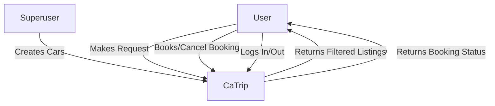
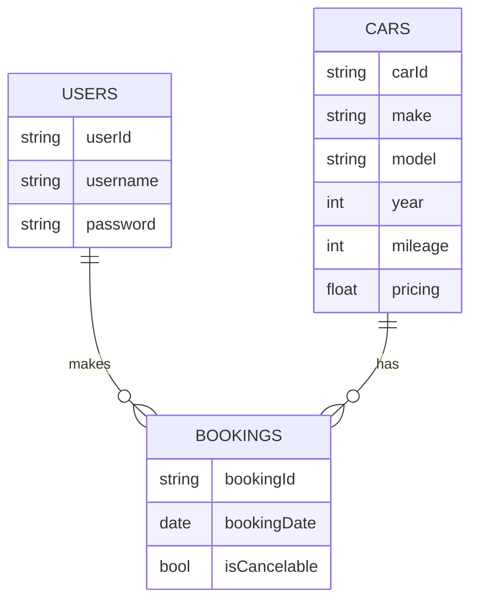
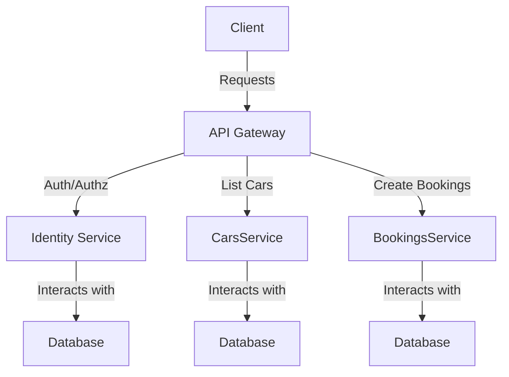

# **Problem Definition**

---

## Background

In the evolving landscape of online marketplaces, there is a need for a specialized platform that caters to the automotive industry. The **Car Listing Marketplace** aims to provide a seamless experience for users to browse, search, and interact with car listings. The platform allows superusers to contribute by creating listings, and users can easily find and book cars based on their preferences.

## Functional Requirements

1. Superusers can create car listings.
2. Users can search for cars by make or model.
3. Users can filter searches by pricing, year, mileage, or other car specifications.
4. Users can book and cancel car bookings.
5. Searches reflect bookings made by other users.
6. Bookings cannot be canceled within the first 24 hours.

## Constraints

- The system should be built using Node.js.
- User sessions should be properly handled.

# Problem Analysis

---

### System Context Diagram

Inputs: User requests, Superuser input

Output: Filtered car listings, Bookings

### Functional Decomposition

1. **Cars Service**
    - Subsystem responsible for handling car-related functionalities.
        - Manages car creation by superusers.
        - Facilitates car search and filtering for users.
        - Handles booking and cancellation requests.
        - Ensures bookings reflect in searches.
2. Identity Service
    - Subsystem responsible for handling user authentication and sessions.
        - Manages user logins and logouts.
        - Ensures secure access to user-specific functionalities.
3. Booking service
    1. Subsystem responsible for handling booking creation and delation 
        1. List bookings 
        2. Delete bookings

### Domain-Driven Analysis

- **Car Domain**
    - Entities: Car, Booking
    - Repositories: CarRepository, BookingRepository
    - Services: CarsService, BookingsService
- **User Domain**
    - Entities: User
    - Repositories: UserRepository
    - Services: UsersService

## System Quality Attributes

- **Availability**: Target 99.9% uptime.
- **Scalability**: Should handle increased user and listing volume gracefully.
- **Security**: Implement secure user authentication and data encryption.
- **Maintainability**: Codebase should be modular and well-documented.
- **Testability**: Implement comprehensive unit and integration testing.

# Proposed Solution (Architecture)

---

Describe the solution to the problems outlined above. Include enough detail to allow for productive discussion and comments from readers.

## High-Level Architecture

- **API Gateway**: Central entry point for all requests, Can enforce role-based access in coordination with the Identity service
- **CarsService**: Manages car-related functionalities.
- **BookingsService**: Manages car-related functionalities.
- **IdentityService**: Handles user authentication and sessions.

## Detailed Components

## API Collection

# Open questions

## Assumptions
